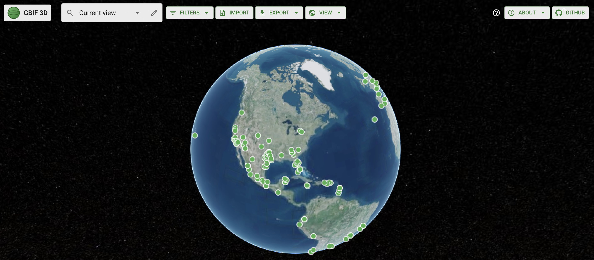

# GBIF 3D

**Interactive 3D globe visualization of GBIF biodiversity occurrence data.**


## About

Explore where species have been recorded on an interactive 3D globe. Data comes from GBIF: millions of observations from museums, surveys, and citizen science.

Pick a region or search for a place, import your own GBIF-style datasets, filter by species or year, and draw your own area. Each dot is an occurrence; colors show IUCN status. Use the **timeline** at the bottom to filter by year. Use **View** for 3D/2D, base maps, and optional Photorealistic 3D. Export current data as image, GeoJSON, CSV, or PDF.

Built with Next.js, Cesium (Resium), and the GBIF API.



## Features

- **3D interactive globe** — Pan, zoom, tilt, and rotate using CesiumJS
- **Region selection** — In the top bar: choose World or a continent, search places by name (Photon / komoot), or pick a saved favorite. With no region selected, camera bounds at filter-apply time are used; panning alone does not refetch
- **Draw region** — Click points on the globe to outline a polygon (double-click or **Finish** to close it) and fetch occurrences for that area; save it as a favorite or clear it. Regions crossing the antimeridian are handled (sent to GBIF as a `MULTIPOLYGON`)
- **Saved favorites** — Save a drawn polygon (or region bounds) as a named favorite (stored in browser); quick access from the Region dropdown
- **GBIF data** — Occurrences fetched for the selected region (or camera bounds when filters are applied), plus filters
- **Import your own data** — Load GBIF-style CSV/TSV, JSON, or a Darwin Core Archive (`.zip`) and explore it on the globe alongside live and saved data (`displayed-occurrences` merges all three)
- **Filters** — Species/taxon search (autocomplete), taxonomic group, date range, IUCN Red List status; advanced: Basis of Record, Continent, Country (ISO 2-letter code), Dataset key, Institution code
- **Visualization** — Points on the globe, color-coded by IUCN threat level; in primitive mode points use a fixed height above the ellipsoid (not terrain-clamped)
- **Tooltips** — Click any point for species name, date, location, photo(s), and link to the GBIF record
- **Terrain** — Cesium World Terrain (optional Ion token); elevation visible when zoomed
- **Export** — Save current view as PNG image, visible occurrences as GeoJSON or CSV, or generate a PDF report with map snapshot and species summary
- **Accessibility** — Skip link, keyboard focus, color-blind friendly palette, aria-labels on controls
- **Performance** — Caching to reduce API load; configurable result limit (100–100,000, default 1,000, fetched in chunks of 300 per request — GBIF API max)

## Tech stack

- **Frontend:** Next.js 15 (App Router) + TypeScript
- **3D Globe:** CesiumJS with [Resium](https://resium.reearth.io/) for React
- **API:** GBIF v1 (`/occurrence/search`, `/species/suggest`)
- **UI:** Material-UI (MUI) for top bar and filters
- **Deployment:** Vercel-ready

All dependencies are open-source (MIT-compatible).

## Security

- **No secrets in code** — The app uses only the public GBIF API; no API keys are required. The optional Cesium Ion token is read from `NEXT_PUBLIC_CESIUM_ION_TOKEN` (e.g. in Vercel env) and never committed.
- **XSS mitigation** — Text from GBIF (species names, dates, locations) is escaped before being shown in the InfoBox.
- **Lightbox** — Only `https://` image URLs are accepted for the photo lightbox (no `javascript:` or `data:`).
- **API routes** — Occurrence image route validates the key; places search proxies to [Photon](https://photon.komoot.io/) (komoot) and is cached for 60 minutes (`RESULT_TTL_MS`). Photon does not require a Nominatim-style User-Agent env var.
- **Imports** — Uploaded files are size-limited (including the uncompressed size of `.zip` entries) and rows with invalid coordinates are rejected. Imported records get synthetic negative keys so they never collide with live GBIF records.
- **CSV export** — Non-numeric cells starting with `=`, `+`, `-`, `@`, tab or carriage return are prefixed with `'` to prevent spreadsheet formula injection.
- **Dependencies** — Run `npm audit` and address high/critical findings before deployment.

## Caching and when data refreshes

Occurrence requests to the GBIF API are **cached in memory** (per geometry + filters + offset, plus the aggregated result of a chunked query) to reduce rate-limit risk:

- **When it’s used:** The same search (same region, filters, and limit) returns cached results if the entry is still valid.
- **When it refreshes:**
  - **After 15 minutes:** Each occurrence cache entry expires after 15 minutes (species suggest uses a shorter TTL; place search is cached for 60 minutes). The next request for that search then calls the API again.
  - **When evicted:** The cache is bounded (1,000 entries / 300,000 records); least-recently-used entries are dropped first.
  - **On page reload:** The cache is empty (in-memory only), so the first load after a refresh always hits the API.
- **Not persisted:** We don’t store the cache in `localStorage` or `sessionStorage` because occurrence responses can be large; keeping them in memory avoids storage limits and keeps the logic simple.

So revisiting the same region with the same filters within 15 minutes does not call the API again until the TTL has passed, the entry is evicted, or you reload the page.

## How to Use (Operating Instructions)

### Step 1: Select a Region
- Use the region field in the top bar to:
  - Choose a predefined region (World or a continent)
  - Search for a place by name (e.g., "Paris", "New York") via Photon
  - Pick a saved favorite region
- With **no region selected**, data uses the area visible on the globe **when you apply filters**. Panning alone does not refetch — re-apply a filter or pick a region.
- Choosing a region flies the camera there and loads occurrences for that area

### Step 2: Filter Occurrences
Click **Filters** in the top bar to refine your search:
- **Species/Taxon** — Search by scientific or common name (e.g., "bee", "Apis", "house cat"); you can add multiple species
- **Taxonomic group** — Choose a broad category (Mammals, Birds, Plants, etc.)
- **Date range** — Enter start and end dates (YYYY-MM-DD format); dates in the future are clamped to today
- **IUCN Red List** — Filter by threat status (Critically Endangered, Endangered, Extinct, Not Evaluated, etc.)
- **Advanced** — Additional options:
  - **Basis of record** — e.g., Human observation, Preserved specimen
  - **Continent** — Filter by continent
  - **Country** — ISO 2-letter code (e.g., US, GB, DE)
  - **Dataset key** — Filter by specific GBIF dataset UUID
  - **Institution code** — e.g., USNM, NHM
- **Max results** — Set how many occurrences to fetch (100–100,000; applied when you leave the field or press Enter)

### Step 3: Explore Occurrences
- **View points** — Each occurrence appears as a colored dot on the globe (colors indicate IUCN status; palette is colour-blind friendly: black / brown / orange / gold / blue / green / grey)
- **Click a point** — Opens an info box with species name, date, location, photos (if available), and a link to the full GBIF record
- **Timeline** — Use the timeline at the bottom to filter by year and month; click a year bar to see only occurrences from that year
- **Navigate** — Pan, zoom, and rotate the globe with your mouse or touch gestures. Bottom-right controls reset the view (home) or point north.

### Step 4: Draw a Custom Region (Optional)
- Click **Draw region** in the top bar
- Click points on the globe to outline a **polygon**; double-click (or click **Finish**) to close it
- Occurrences will load for that area
- Save it as a favorite from the Region dropdown for quick access later

### Step 5: Import Your Own Data (Optional)
Click **Import** in the top bar and pick a file:
- **CSV / TSV** — GBIF occurrence download format (columns such as `decimalLatitude`, `decimalLongitude`, `scientificName`, `eventDate`); headers are matched case-insensitively
- **JSON** — A GBIF API response (`{ results: [...] }`) or a plain array of occurrences
- **Darwin Core Archive (.zip)** — The `occurrence.txt` core is read directly from the archive

Imported records are merged with live API results and saved occurrences for display, and can be exported like live data. They get negative keys so they never collide with GBIF records.

### Step 6: Export Data (Optional)
Click **Export** in the top bar to save:
- **Image** — Current view as PNG
- **GeoJSON** — Visible occurrences as GeoJSON (RFC 7946; the selected region is included as a `Polygon`/`MultiPolygon` feature)
- **CSV** — Visible occurrences as CSV (the selected region is included as `regionName`/`regionWkt` columns)
- **PDF** — Report with map snapshot, species summary, and filter details

### Step 7: Change View Options
Click **View** in the top bar to:
- Switch between **3D Globe** and **2D Map**
- Change base map (default **Carto Positron**; also OpenStreetMap, OpenTopoMap, Dark Matter; Bing Aerial requires a Cesium Ion token)
- Enable **Photorealistic 3D** (requires Cesium Ion token)

---

## Quick start (For Developers)

### Prerequisites

- Node.js 18+
- npm or yarn

### Setup

```bash
git clone https://github.com/karimogit/GBIF3D.git
cd GBIF3D
npm install
```

The `postinstall` script links Cesium assets to `public/cesium` (symlink on macOS/Linux, junction on Windows, copy on CI or if linking fails). If you skip it, ensure `public/cesium` contains the Cesium build (e.g. from `node_modules/cesium/Build/Cesium`).

### Environment variables

All are optional. Put them in `.env.local` for development or in your hosting provider's environment settings.

| Variable | Purpose |
| --- | --- |
| `NEXT_PUBLIC_CESIUM_ION_TOKEN` | [Cesium Ion](https://cesium.com/ion/) access token. Enables Cesium World Terrain, Bing base maps and Photorealistic 3D. Without it the app defaults to **Carto Positron** and a flat ellipsoid and disables the Ion-only options in the **View** menu. |
| `PHOTON_USER_AGENT` | Optional User-Agent for Photon place search. Defaults to `GBIF3D/1.0 (...)`. Photon does **not** require `NOMINATIM_USER_AGENT` (that env var is unused). |
| `NEXT_PUBLIC_GITHUB_REPO_URL` | Overrides the repository link shown in the top bar and About menu. |

### Run locally

```bash
npm run dev
```

Open [http://localhost:3000](http://localhost:3000) and follow the [How to Use](#how-to-use-operating-instructions) instructions above.

**If you see 404s for `/_next/static/...` or "MIME type ('text/plain')" errors:** You are not running the Next.js dev server. Stop whatever is on port 3000, then run `rm -rf .next` and `npm run dev`. Do not serve the project with a generic static server (e.g. `npx serve`).

### Build for production

```bash
npm run build
npm start
```

**Build note:** Keep `next` and related tooling (e.g. `eslint-config-next`, SWC) on matching versions when upgrading Next.js.

### Lint and type-check

```bash
npm run lint       # ESLint 9 (flat config, next/core-web-vitals + next/typescript)
npm run typecheck  # tsc --noEmit
```

### Deploy on Vercel

1. Push the repo to GitHub.
2. In [Vercel](https://vercel.com), import the project and deploy.
3. Ensure build command is `npm run build` and output is Next.js.
4. **Optional — Cesium Ion:** For Cesium World Terrain and Ion imagery, set `NEXT_PUBLIC_CESIUM_ION_TOKEN` in your Vercel project Environment Variables to your [Cesium Ion](https://cesium.com/ion/) access token. The app sets `Cesium.Ion.defaultAccessToken` from this before any Ion requests.

## Example queries

- **Forest species in Europe:** Select region “Europe”, set taxonomic group to “Plants”, optionally search for e.g. *Pinus sylvestris*.
- **Birds in a region:** Select region “Europe” (or leave region empty, pan, then apply a filter), set taxonomic group to “Birds”.
- **Threatened species:** Set IUCN Red List to “Endangered” or “Vulnerable”, select a region or apply filters with the current camera bounds, and explore.

## API usage

The app uses:

- **Occurrence search:** `GET https://api.gbif.org/v1/occurrence/search` with `geometry` (WKT polygon from view bounds), `taxonKey`, `year`, `eventDate`, `iucnRedListCategory`, `basisOfRecord`, `continent`, `country`, `datasetKey`, `institutionCode`, `limit`, etc.
- **Species suggest:** `GET https://api.gbif.org/v1/species/suggest?q=...` for autocomplete.
- **Places (Photon):** `/api/places/search?q=...` — server proxy to [Photon](https://photon.komoot.io/) (komoot) for place search; returns bounding boxes for the Region field. Results are cached for 60 minutes.
- **Occurrence images:** `/api/occurrence/[key]/image` — returns image URLs for an occurrence (from GBIF cache) for the InfoBox photo strip.

See [Caching and when data refreshes](#caching-and-when-data-refreshes) for cache lifetimes. No API key required for normal use; Cesium Ion token is optional for World Terrain.

### Map tiles

The **default** base map is [Carto Positron](https://carto.com/basemaps/) (`*.basemaps.cartocdn.com`). OpenStreetMap (`https://tile.openstreetmap.org/`) and other styles are available under **View**. Use of OSM tiles must comply with the [OpenStreetMap Tile Usage Policy](https://operations.osmfoundation.org/policies/tiles/); avoid heavy automated requests and respect the usage guidelines.

## Project structure

```
├── app/
│   ├── layout.tsx         # Root layout, Cesium CSS, providers
│   ├── page.tsx           # Main page: GlobeViewer, MapTopBar, import/export handlers
│   ├── globals.css        # Global styles, accessibility
│   ├── providers.tsx      # MUI ThemeProvider
│   └── api/
│       ├── places/search/ # Photon (komoot) proxy for place search (cached 60 min)
│       ├── species/suggest/ # GBIF species suggest proxy (CORS)
│       ├── species/search/ # GBIF species search proxy (CORS)
│       └── occurrence/[key]/image/ # Occurrence images (GBIF cache)
├── components/
│   ├── GlobeViewer.tsx    # Fetches occurrences by bounds/filters, renders GlobeScene + legend
│   ├── GlobeViewerDynamic.tsx # Dynamic import (no SSR) for globe
│   ├── GlobeScene.tsx     # Resium Viewer wiring (terrain, base layer, handlers)
│   ├── globe/             # Scene handlers, occurrence layer (entities/primitives), InfoBox HTML, imagery, export helpers
│   ├── MapTopBar.tsx      # Top bar: Region/place search, Filters, Import, Export, View, Saved, About, Help
│   ├── map-top-bar/       # Dialogs and menu contents used by MapTopBar
│   ├── FilterForm.tsx     # Filters popover content
│   ├── OccurrenceTimeline.tsx # Year/month timeline filter
│   ├── SpeciesSearch.tsx  # GBIF species suggest autocomplete
│   ├── ErrorBoundary.tsx  # Error boundary around globe
│   └── Lightbox.tsx       # Photo lightbox from InfoBox
├── lib/
│   ├── gbif.ts            # GBIF API client (occurrence search, chunked fetching, species suggest)
│   ├── geometry.ts        # Bounds/polygons ↔ WKT (antimeridian-aware), point-in-polygon
│   ├── regions.ts         # Predefined regions for Region dropdown
│   ├── cache.ts           # Bounded LRU in-memory cache for API responses
│   ├── favorites.ts       # Saved regions (localStorage)
│   ├── saved-occurrences.ts # Saved occurrences (localStorage)
│   ├── displayed-occurrences.ts # Merges live, imported and saved occurrences for display
│   ├── import-occurrences.ts # CSV/TSV/JSON/DwC-A parsing
│   ├── export-data.ts     # GeoJSON/CSV export
│   ├── pdf-export.ts      # PDF report
│   ├── occurrence-date.ts # Date parsing helpers
│   └── ion.ts             # Cesium Ion token configuration
├── types/
│   └── gbif.ts            # TypeScript types for GBIF responses
├── __tests__/
│   └── lib/               # Unit tests for gbif, geometry, cache, regions, import, export
├── eslint.config.mjs      # ESLint 9 flat config
├── next.config.js         # Security headers, Resium ESM alias, CESIUM_BASE_URL
├── package.json           # postinstall: link Cesium Build to public/cesium
└── README.md
```

## Testing

```bash
npm test
```

Tests include:

- **GBIF API:** Occurrence search with geometry, taxonKey; species suggest; error handling (mocked `fetch`)
- **Geometry:** WKT polygon from bounds and drawn polygons (counter-clockwise, lon/lat), antimeridian handling (`MULTIPOLYGON`), point-in-bounds/polygon, bounds padding
- **Cache:** TTL expiry, LRU eviction, weight budget
- **Import:** CSV/TSV/JSON detection, DwC-A entry selection, header matching, date parsing, synthetic keys
- **Export:** CSV formula-injection guard, region columns, GeoJSON winding and `MultiPolygon` output

## Accessibility

- Skip link to main content
- Visible keyboard focus (green outline)
- Color-blind friendly point colors (not red-green only): black / brown / orange / gold / blue / green / grey for IUCN categories

## License

MIT. See [LICENSE](LICENSE) for details.

## Acknowledgments

- **Developer:** [Karim Osman](https://kar.im)
- [GBIF](https://www.gbif.org/) for open biodiversity data and API
- [Cesium](https://cesium.com/) and [Resium](https://resium.reearth.io/) for the 3D globe
